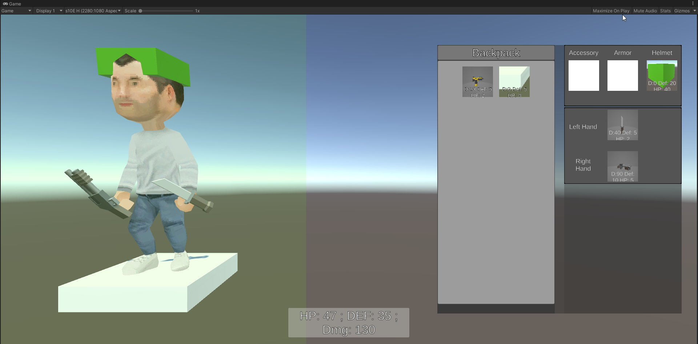

# eksp
Unity: 2021.1.0f1

6-7 hours of progress

video version without item display values

<video width="720" controls>
  <source src="documentation/demo.mp4" type="video/mp4">
</video>

## How to test
- By holding left click on the green panel you can rotate the player - it will rotate even verticaly etc.
- Right clicking an item will equip/unequip or replace another item depending on quality
## Implementation

- Extensible inventory system
- Managable Items
- If there is already everything equipped then it will swap out the worst item depending on the average
- Inventory saves and loads from Scriptable Objects
- if the developer chooses he can have from 0 to +99 accessory items, as it will stack
- Shows the players stats depending on the equipment worn
- Items show their stats that would apply to the player
- Showcase of Singleton, UnityAction, AnimationCurve and a look how i would rapidly develop code that needs to be refactored

## Flaws

- Arhitecture might not be the best as it can be repetitive implementing UnityActions for the display of player equipment
- Script naming should be better
- didn't add armor and accessory items (but there is weapons and Helmet which have the 96% same code)
- Flaw or pro but you cannot have the same item in the inventory, just like a block in a blockchain it should be unique - items has Guid

## Please provide a brief explanation of your thought process and any challenges you encountered while completing the task.

I started this project by implementing the 360deg rotation platform 
I had to look up this "Transform.InverseTransformPoint"

Then i started to implement the item/sockets and the equipment
I had to think/meditate for a solid 5-10minutes in order to start creating it as i had to think of a decent way of implementing the inventory system on a fly.

in a lot of places in PlayerStorage.cs I used Linq to quickly sift through array as writing for each loops are really beginner tactics

the most challenging part of this was tryting to complete this withing 7 hours which i kinda managed to do.

The only part left for this is refactoring as there are some places where code style changes and thats really a issue that i didnt follow a set of code style so there are private fields like: "_item" or "item" but thats a minor flaw.

But there was one challenging part trying to make it modular and with the least amount of complexity im certaint that if i had to make this again i would have a better view on how to accomplish this.